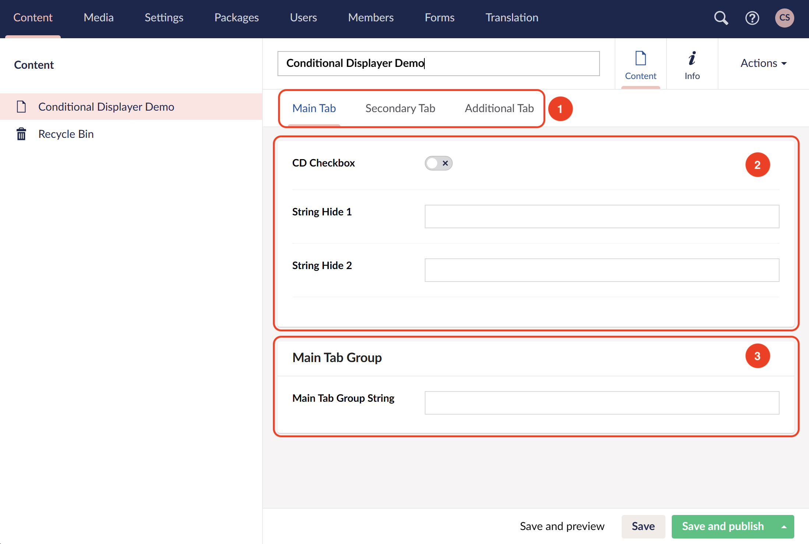

# Hiding and Showing Tabs and Groups

With Conditional Displayers you can also show and hide an entire Tab, a Tab's Content Group and Group Panels.

Unlike properties, we're not exposed to any aliases for any of these elements, but as our code uses the data attribute 'data-element', we were able to get this working.

These elements' data attribute is generated based on their names/titles (similar to Properties), except that they're not visible to us.

Given that they need to have unique names/titles, we will be able to target them in a similar way we do for Properties.

With this available now, you can even target groups that sit under different tabs.

> ℹ️ Did you know that you actually can target Properties that are in different tabs than the Conditional Displayer Property?

## How to target the different sections

### 1. Tabs

- Using the screenshot as an example, the tab name 'Main Tab' will have a data-element attribute of **'tab-mainTab'**.
- Every tab's data-element attribute would use the same naming convention (i.e **'tab-secondaryTab'**, **'tab-additionalTab'**).
- To target any Tab, you must declare its full data-element value (i.e **'tab-mainTab'** etc).

### 2. Content Groups

- This is the group of properties that sit as the first group in the tab without title.
- The group will use the Tab name as part of its data-element attribute like so **'tab-content-mainTab'**.
- To target a Content Group, you must declare its full data-element value (i.e **'tab-content-mainTab'** etc).

### 3. Group Panels

- Lastly the Group Panels will use both the Tab name and it's own name/title as its data-element attribute
- From our screenshot example, the 'Main Tab Group' will have a data-element attribute of **'group-mainTab/mainTabGroup'**.
- To target a Group Panel, you must declare its full data-element value (i.e **'group-mainTab/mainTabGroup'** etc) including the forward slash.

### Double Checking

You can always use the Dev Tools to inspect all these elements and verify that you got the right value.

### Configuring The Displayers

Similar to what we usually do with properties, we will just need to include those values in our Data Type configuration.

Essentially you can target Properties, Tabs, Content Groups and Group Panels together. You just need to plan out what you're hiding and showing at the same time.

> ⚠️ **IMPORTANT:** Just be careful you don't hide any element that contains the Conditional Displayer that targets it, otherwise you will have to reconfigure it to make its group or tab visible again and you may end up in a confusing mess.
